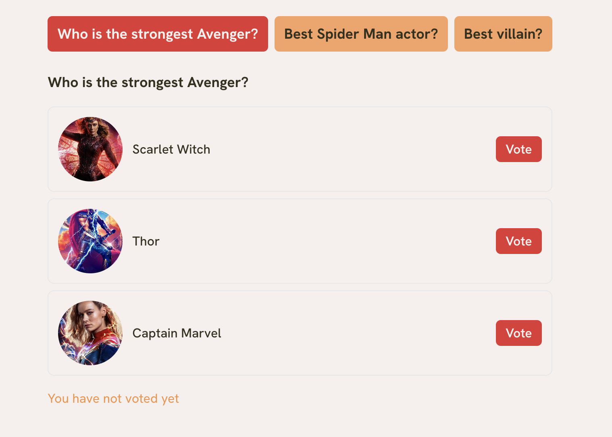
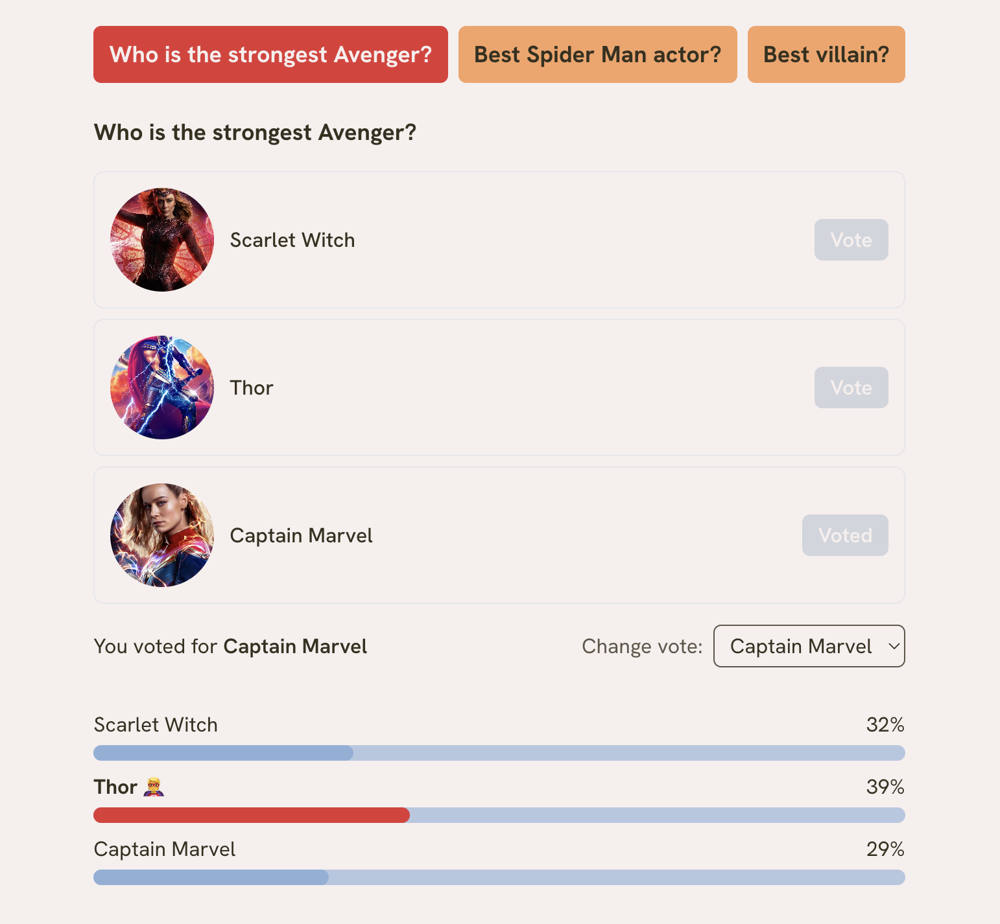
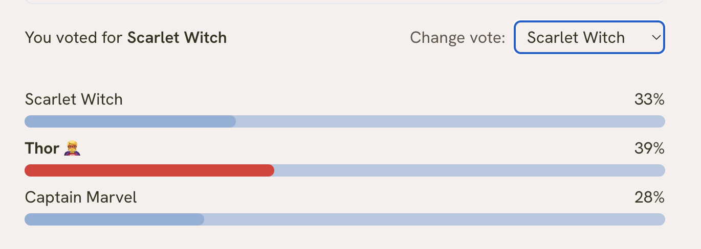

# Marvel Polls

A small single-page voting app built with Next.js and TypeScript. Users
vote on three Marvel-themed polls, see live results as percentages, and can
change their vote at any point.

## Features

- **Three independent polls**, switchable via tabs
- **Vote once per poll** — casting a vote reveals live results (a
  percentage bar per option) that were hidden beforehand
- **Change your vote** — swap to a different option via a dropdown;
  the old option loses a vote, the new one gains it, and results update
- **Leading option highlight** — the option (or options, in a tie) with
  the most votes is marked with a super hero icon
- **Independent poll state** — voting on one poll doesn't affect another;
  switching tabs and back preserves your vote

## Screenshots

*A poll before the user has voted — no results shown yet.*

*After voting, results appear with percentages and an icon on the
leading option.*

*The change vote dropdown, used to switch to a different option.*

## Tests

All tests are in `__tests__/`, organized into:
- `lib/` — unit tests for the pure percentage/winner-calculation logic
- `components/` — unit tests for each individual components
- `integration/` — tests covering multiple components working together
  (voting, changing a vote, switching between polls)

Run tests with `npm test`.